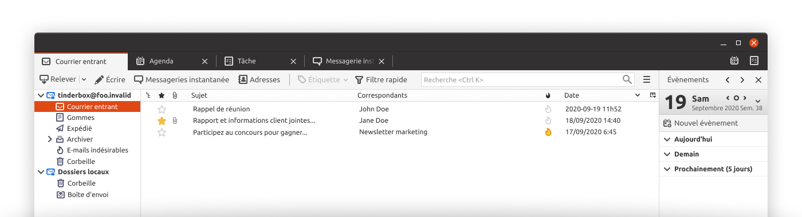
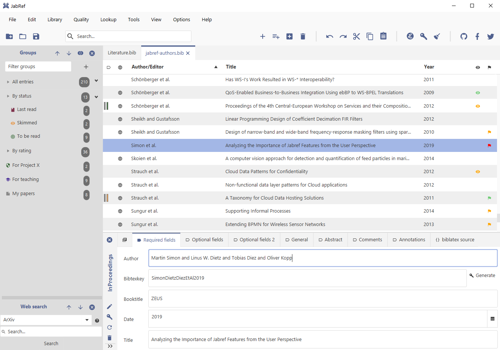
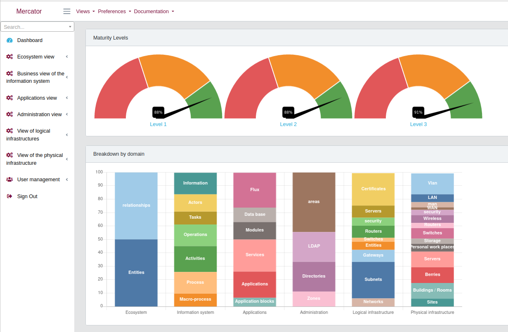
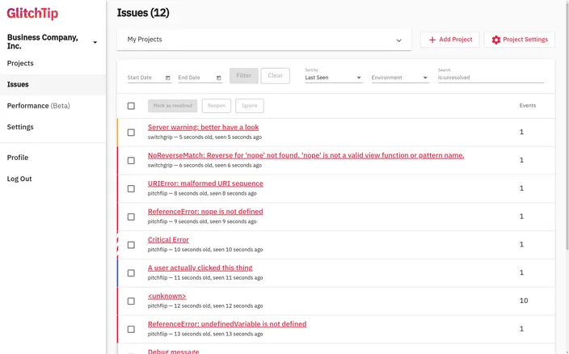
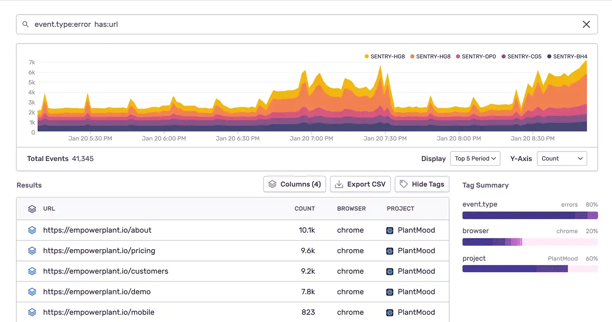

# Peertube

**Site du logiciel** : [joinpeertube.org](https://joinpeertube.org/) ([lien SILL](https://sill.etalab.gouv.fr/fr/software?id=197))

**Son code source** : [github.com/Chocobozzz/PeerTube](https://github.com/Chocobozzz/PeerTube)

**Langages de programmation** : TypeScript, Javascript.

**Ministère utilisateur et porteur de la contribution** : Ministère de
l'Éducation nationale, de la Jeunesse et des Sports.

**Description du logiciel et de son usage dans l'administration** :
Peertube est une plateforme de publication de vidéos en ligne.  Cette
plateforme est déployée dans des académies (voir le site PAPILLON) et
elle est notamment associée à la plateforme interministérielle de
formation en ligne Mentor (Moodle).  Via cette plateforme, elle est
utilisée aujourd'hui par 6000 agents avec objectif à 900000 sur 3 ans.

**Idée de contribution** : Le stage permettra de développer des modules
pour répondre à différents besoins spécifiques comme le fait de
remplacer une vidéo et de modifier les paramètres par défaut lors du
dépôt de fichier vidéos.  Le but est d'améliorer l'intégration de
ressources vidéos dans les formations portées par les ministères
impliqués dans Mentor.

# Thunderbird

**Site du logiciel** : [thunderbird.net](https://www.thunderbird.net/fr/)

**Son code source** : [hg.mozilla.org/comm-central](https://hg.mozilla.org/comm-central/) - voir aussi [cette page](https://www.thunderbird.net/en-US/get-involved/)
pour des explications sur les façons de contribuer.

**Langages de programmation** : C++, Javascript.

**Ministère utilisateur et porteur de la contribution** : Ministère de
l'Éducation nationale, de la Jeunesse et des Sports et ministère de
l'Enseignement supérieur, de la Recherche et de l'Innovation.

**Description du logiciel et de son usage dans l'administration** : Ce
logiciel est utilisé par de très nombreux agents publics dans maintes
administrations.  

**Idée de contribution** : Une idée de contribution serait d'améliorer le
support du protocole [matrix](https://matrix.org/) pour éviter l'utilisation d'un onglet de
navigateur ou d'un client lourd comme [Element](https://element.io/) pour l'utilisation de
[Tchap](https://www.tchap.gouv.fr/) et ainsi centraliser les outils de communication.  Une autre
idée serait de développer un module de supervision qui permette de
répondre à la question : « Est-ce que le système m'a bien envoyé un
email par jour pour me dire que le mail attendu n'est pas arrivé ? »

# JabRef

**Site du logiciel** : [www.jabref.org](https://www.jabref.org)

**Son code source** : [github.com/JabRef/jabref](https://github.com/JabRef/jabref) - voir aussi [cette page](https://devdocs.jabref.org/contributing)
pour des explications sur les façons de contribuer.

**Langages de programmation** : Java.

**Ministère utilisateur et porteur de la contribution** : Ministère de
l’Enseignement supérieur, de la Recherche et de l’Innovation.

**Description du logiciel et de son usage dans l’administration :** JabRef
est un logiciel de gestion bibliographique de premier plan. Il aide
les étudiants, chercheurs et ingénieurs à organiser leurs articles et
à les citer dans leurs futures publications. Il est utilisé dans les
instituts de recherche et les universités en France et dans le
monde. Certains de vos enseignants utilisent probablement JabRef, et
JabRef vous aidera lors de la rédaction de votre rapport de stage !

**Idées de contribution :**

*Notez que vous serez en mesure d'interagir directement avec l'équipe
de développement de JabRef. Elle vous apportera son soutien lors de
vos développements*.

-   Permettre à Word d'être utilisé avec JabRef &#x2013; au niveau de
    l'implémentation, cela veut dire implémenter un serveur GraphQL dans
    JabRef afin que le greffon JabRef-online-Word
    ([github.com/JabRef/JabRef-Word-Addin](https://github.com/JabRef/JabRef-Word-Addin)) puisse aussi fonctionner avec
    JabRef ([github.com/JabRef/jabref/issues/6904](https://github.com/JabRef/jabref/issues/6904)).

-   Ajouter la possibilité de faire du Mind Mapping avec JabRef. Cela
    serait une fonctionnalité très intéressante
    ([github.com/koppor/jabref/issues/433](https://github.com/koppor/jabref/issues/433)).

-   Utiliser Apache Lucene pour la recherche d'entrées bibliographiques
    dans la base de données courante. Apache Lucene est un moteur
    d'indexation et de recherche pour du texte. Apache Lucene est
    actuellment utilisé par JabRef lors de la recherche sur les fichiers
    PDF. Avec ce projet, la recherche basée sur Apache Lucene sera aussi
    utilisée pour les entrées bibliographiques.

-   Parcourez notre liste de tâches pour les projets universitaires sur
    [github.com/JabRef/jabref/projects/9](https://github.com/JabRef/jabref/projects/9) et choisissez celles qui vous
    plaisent.

# Assistant RGAA

**Site du logiciel** : [empreinte-digitale/assistant-rgaa](https://github.com/empreinte-digitale/assistant-rgaa)

**Son code source** : [github.com/empreinte-digitale/assistant-rgaa](https://github.com/empreinte-digitale/assistant-rgaa)

**Langages de programmation** : Javascript (React.js, Lodash, Babel)

**Ministère utilisateur et porteur de la contribution** : Direction
interministérielle du numérique.

**Description du logiciel et de son usage dans l'administration** :
L'assistant RGAA est une extension pour Firefox et Chrome utilisé par
les auditeurs du RGAA (Référentiel général d'amélioration de
l'accessibilité) et par les développeurs de sites et d'applications
web.  À ce jour, une dizaine d'agents publics l'utilisent au
quotidien, et deux agents y contribuent déjà.

**Idée de contribution** : L'idée est de faciliter la réalisation des
audits RGAA.  L’assistant n’est pour l’instant qu’un guide pas-à-pas
dans la menée d’un audit. Il pourrait permettre de stocker les
résultats et de les exporter, par exemple vers un outil de rapport.
De même il pourrait importer des résultats d’audit partiel réalisés
par des outils automatiques tels que Tanaguru ou Asqatasun.  La DINUM
travaille déjà sur cette contribution, notamment en explorant le
format standardisé du W3C pour les rapports d’audits WCAG-EM-Report
Tool.

# Mercator

**Site du logiciel** : [Mercator](https://github.com/dbarzin/mercator)

**Son code source** : [github.com/dbarzin/mercator/](https://github.com/dbarzin/mercator)

**Langages de programmation** : HTML, PHP.

**Ministère utilisateur et porteur de la contribution** : Direction
générale de l'Aviation civile, Direction technique de l'innovation.

**Description du logiciel et de son usage dans l'administration** :
Mercator permet d'élaborer une cartographie d'un système d'information
afin d'être capable de mieux anticiper et faire face aux problèmes de
sécurité du système d'information en question.  Le logiciel n'est pas
encore utilisé à la DGAC, mais il manque peu pour que Mercator vienne
remplacer les méthodes trop artisanales aujourd'hui en place, et nous
sommes en contact avec le développeur principal.

**Idée de contribution** : Le but est de tester Mercator et de voir
comment faciliter son installation à la DGAC, le tout en discutant en
direct avec le développeur principal avec qui la DGAC est en contact.
À terme, l'intérêt pour l'administration est d'avoir une solution en
logiciel libre conforme aux recommandations de l'Agence nationale de
la sécurité des systèmes d'information (ANSSI) en matière de
*configuration management database* (CMDB).

# GlitchTip

**Site du logiciel** : [glitchtip.com](https://glitchtip.com/)

**Son code source** : [gitlab.com/glitchtip](https://gitlab.com/glitchtip)

**Langages de programmation** : Python, Javascript.

**Ministère utilisateur et porteur de la contribution** : Ministère de la
Justice.

**Description du logiciel et de son usage dans l'administration** :
GlitchTip permet de collecter et de visualiser les erreurs émises par
une application.  Cette application n'est pas encore utilisée mais
elle est très demandée au ministère de la Justice car elle permettrait
un meilleur suivi des déploiements et des bugs.

**Idée de contribution** : Aujourd'hui, GlitchTip est déployable avec
Docker.  Le but du stage serait d'explorer d'autres façons de déployer
GlitchTip, par exemple avec NixOS.  Idéalement, nous pourrions aussi
voir comment brancher GlitchTip sur des SSO classiques comme
LemonLDAP, ainsi qu'ajouter des tutoriels en français.  Le ministère
porteur de la contribution a déjà un agent public qui contribue à
GlitchTip, facilitant ainsi le lien avec le projet et l'intégration
des contributions.

# Sentry

**Site du logiciel** : [sentry.io](https://sentry.io)

**Son code source** : [github.com/getsentry/sentry](https://github.com/getsentry/sentry)

**Langages de programmation** : Python, Javascript.

**Ministère utilisateur et porteur de la contribution** : Ministère de
l'Économie, des Finances et de la Relance, pôle d'expertise et de
régulation numérique - [PEReN](https://www.peren.gouv.fr/).

**Description du logiciel et de son usage dans l'administration** :
sentry.io permet de suivre les bugs directement en production.  SEntry
existe en version installable (voir [getsentry/onpremise](https://github.com/getsentry/onpremise)) et en
*Software as a Service* (SaaS), mais cette dernière version est
difficilement utilisable pour des raisons évidentes de confidentialité
de données (personnelles ou métiers). 

**Idée de contribution** : Le but de la contribution serait de faciliter
l'installation de SEntry dans différents environnements.  Aujourd'hui,
la seule méthode d'installation officiellement supportée est Docker,
Un *repackaging* "administration publique" de cet outil, incluant une
dé-dockerisation serait très utile pour les ministères régaliens.

# À préciser

## Platform manager

**Site du logiciel** : 

**Son code source** : [pfmanager.loria.fr](https://pfmanager.loria.fr)

**Langages de programmation** : 

**Ministère utilisateur et porteur de la contribution** : MESRI/CNRS

**Description du logiciel et de son usage dans l'administration** : Au
sein du laboratoire Loria (UMR 7503 CNRS / Inria / Université de
Lorraine), nous utilisons plusieurs plateformes en soutien de la
recherche. Nous avons créé l’outil 'Platform manager' pour nous aider
à gérer ces installations: projets en cours, équipements, utilisateurs

**Idée de contribution** : L'objectif du stage sera d'apporter deux
fonctionnalités à ce logiciel pour 1) l'ajout d'un module de
réservation d'équipement avec calendrier, 2) la génération automatique
de pages wiki Gitlab par projet.

## Libre office : Writer, Calc et Impress

**Site du logiciel** :

**Son code source** :

**Langages de programmation** :

**Ministère utilisateur et porteur de la contribution** : 

**Description du logiciel et de son usage dans l'administration** :

**Idée de contribution** : 

## Openboard

**Site du logiciel** :

**Son code source** :

**Langages de programmation** :

**Ministère utilisateur et porteur de la contribution** : 

**Description du logiciel et de son usage dans l'administration** :

**Idée de contribution** : 

## Spoon

**Site du logiciel** :

**Son code source** :

**Langages de programmation** :

**Ministère utilisateur et porteur de la contribution** : 

**Description du logiciel et de son usage dans l'administration** :

**Idée de contribution** : 

## Esup-Pod

**Site du logiciel** : [www.esup-portail.org](https://www.esup-portail.org/wiki/display/ES)

**Son code source** : [github.com/EsupPortail/Esup-Pod](https://github.com/EsupPortail/Esup-Pod)

**Langages de programmation** :

**Ministère utilisateur et porteur de la contribution** : Université de
Lille.

**Description du logiciel et de son usage dans l'administration** : 

**Idée de contribution** : 

## GDL : gnudatalanguage

**Site du logiciel** :

**Son code source** :

**Langages de programmation** :

**Ministère utilisateur et porteur de la contribution** : 

**Description du logiciel et de son usage dans l'administration** :

**Idée de contribution** : 

## Unitex/GramLab

**Site du logiciel** : [unitexgramlab.org](https://unitexgramlab.org/fr)

**Son code source** : [github.com/UnitexGramLab](https://github.com/UnitexGramLab/) - voir aussi [cette page](https://unitexgramlab.org/fr/how-to-contribute)
pour des explications sur les façons de contribuer.

**Langages de programmation** :

**Ministère utilisateur et porteur de la contribution** : Ministère de
l'Enseignement supérieur, de la Recherche et de l'Innovation.

**Description du logiciel et de son usage dans l'administration** :
Unitex/GramLab est utilisé par des laboratoires de recherche pour
explorer et exploiter des corpus de textes dans des projets de
recherche en linguistique et en traitement des langues naturelles.  Il
est compatible avec de nombreuses langues.  Il est utilisé aujourd'hui
par de nombreux étudiants et un agent public y contribue
régulièrement.

**Idée de contribution** : Le champ est libre - il peut s'agir d'ajout de
fonctionnalités, de correction de bugs, d'amélioration de l'interface
ou de toute autre idée discutée avec l'équipe de développement.

## ElabFTW

**Site du logiciel** : [ElabFTW](https://www.elabftw.net)

**Son code source** : [github.com/elabftw/elabftw](https://github.com/elabftw/elabftw)

**Langages de programmation** : PHP/Javascript/HTML

**Ministère utilisateur et porteur de la contribution** : INRAE

**Description du logiciel et de son usage dans l'administration** :
L'outil est utilisé dans plusieurs établissements publics ainsi que
des laboratoires Européens en tnat que cahier de laboratoire
électronique.

**Idée de contribution** : L'objet du stage serait de travailler sur un
interfaçage avec un appareil mobile (liseuse, tablette,&#x2026;) avec une
possibilité de travailler sans connexion internet.

# Projets de l'administration

## APiLos

**Site du logiciel** :

**Son code source** :

**Langages de programmation** :

**Ministère utilisateur et porteur de la contribution** : 

**Description du logiciel et de son usage dans l'administration** :

**Idée de contribution** : 

## OpenTermsArchive

**Site du logiciel** : [opentermsarchive.org](https://opentermsarchive.org)

**Son code source** : [github.com/ambanum/OpenTermsArchive](https://github.com/ambanum/OpenTermsArchive)

**Langages de programmation** : Javascript

**Ministère utilisateur et porteur de la contribution** : Ministère de
l'Europe et des affaires étrangères.

**Description du logiciel et de son usage dans l'administration** :
OpenTermsArchive est utilisé pour suivre les stratégies des grandes
plateformes numériques et pour identifier des leviers diplomatiques
dans les échanges avec elles. Au sein du PEReN (Ministère des
finances), OpenTermsArchive est utilisé pour suivre les évolutions des
conditions d'utilisation des fournisseurs de service par type
d'industrie (en particulier plateformes de mise en relation).  Au sein
de l'autorité de la concurrence, les agents en charges d'enquêtes
peuvent accéder aux conditions d'utilisation des fournisseurs de
services à toute date afin de mener des investigations détaillées.

**Idée de contribution** : 
L'objectif du stage sera de maintenir et de
compléter les descriptions de services qui sont suivis et archivés dans
OpenTermsArchive. En effet, au fur et à mesure des évolutions des documents,
ils peuvent être déplacés vers d'autres URLs, leur contenu peut être modifié et
il faut les filtrer d'une nouvelle manière pour éviter du bruit dans les
changements détectés. Toute liberté sera donnée pour expérimenter des moyens
d'outiller et d'automatiser ces mises à jour cruciales pour le bon
fonctionnement du service. Ces expérimentations seront co-construites et
évaluées par l'équipe coeur, qui pourra le cas échéant allouer des ressources
afin d'aider la personne en stage à industrialiser la solution et la mettre
entre les mains d'un grand nombre d’utilisateurs.

