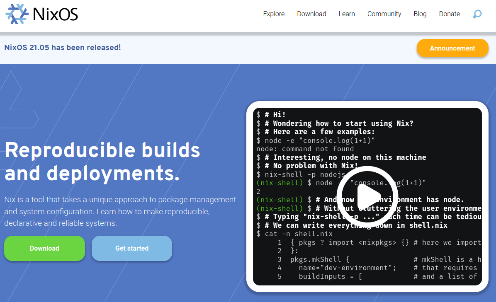

# BSOC: Proposition de contributions à des logiciels libres

## Assistant RGAA : améliorer l'accessibilité des sites web

**Site du logiciel** : [empreinte-digitale/assistant-rgaa](https://github.com/empreinte-digitale/assistant-rgaa)

**Son code source** : [github.com/empreinte-digitale/assistant-rgaa](https://github.com/empreinte-digitale/assistant-rgaa)

**Langages de programmation** : Javascript (React.js, Lodash, Babel)

**Ministère utilisateur et porteur de la contribution** : Direction
interministérielle du numérique.

**Description du logiciel et de son usage dans l'administration** :
L'assistant RGAA est une extension pour Firefox et Chrome utilisé par
les auditeurs du RGAA (Référentiel général d'amélioration de
l'accessibilité) et par les développeurs de sites et d'applications
web.  À ce jour, une dizaine d'agents publics l'utilisent au
quotidien, et deux agents y contribuent déjà.

**Idée de contribution** : L'idée est de faciliter la réalisation des
audits RGAA.  L’assistant n’est pour l’instant qu’un guide pas-à-pas
dans la menée d’un audit. Il pourrait permettre de stocker les
résultats et de les exporter, par exemple vers un outil de rapport.
De même il pourrait importer des résultats d’audit partiel réalisés
par des outils automatiques tels que Tanaguru ou Asqatasun.  La DINUM
travaille déjà sur cette contribution, notamment en explorant le
format standardisé du W3C pour les rapports d’audits WCAG-EM-Report
Tool.

## Esup-Pod : contribuer à une plateforme de diffusion de vidéos

**Site du logiciel** : [www.esup-portail.org](https://www.esup-portail.org/wiki/display/ES)

**Son code source** : [github.com/EsupPortail/Esup-Pod](https://github.com/EsupPortail/Esup-Pod)

**Langages de programmation** : Python.

**Ministère utilisateur et porteur de la contribution** : Université de
Lille, ministère de l'Enseignement, de la Recherche et de
l'Innovation.

**Description du logiciel et de son usage dans l'administration** :
Esup-Pod est une solution d'hébergement et de diffusion de vidéos de
cours, de vidéos institutionnelles et de recherche.  Il y a à ce jour
42 établissements de l'ESR qui ont une instance de Pod mais également
des académies et des ministères.

**Idée de contribution** : L'étudiant sera au contact direct de l'équipe
qui développe le projet.  Une idée de contribution serait de coupler
la solution de diffusion Esup-pod à une autre solution libre de
webconférence, BigBlueButton.  Pour cela, on aimerait étudier le
protocole LTI pour permettre de récupérer les enregistrements de BBB
et les héberger sur Pod, mais également de permettre de diffuser en
direct les webconférences de BBB sur Pod et faire des webinaires.
L'ensemble permettrait à chaque établissement d'avoir une solution de
webinaire en interne, facile à installer et à utiliser.

## GnuDataLanguage : s'immerger dans un logiciel pour l'astronomie professionnelle

**Site du logiciel** : [github.com/gnudatalanguage/gdl](https://github.com/gnudatalanguage/gdl)

**Son code source** : [github.com/gnudatalanguage/gdl](https://github.com/gnudatalanguage/gdl)

**Langages de programmation** : C++

**Ministère utilisateur et porteur de la contribution** : Ministère de
l'Enseignement supérieur, de la Recherche et de l'Innovation.

**Description du logiciel et de son usage dans l'administration** :
GDL est un clone libre d'un logiciel propriétaire payant largement
utilisé en astronomie professionnel.  Il existe un très grand nombre
de codes (pipelines de traitement de données d'instruments sol ou
spatiaux) basés sur ce langage.  Ce langage présente des avantages
techniques évidents par rapport à Python, notamment : simplicité,
efficacité numérique, librairies métier dédiées et largement testées.

**Idées de contribution** : 

-   corriger des bugs connus ;
-   augmenter la couverture des tests (codecov à ~40% aujourd'hui) ;
-   ajouter des fonctionnalités demandées par les utilisateurs ;
-   améliorer les performances de l'interpréteur ;

Ce logiciel est idéal comme cadre pour des stagiaires, car il est
hautement modulaire et utilise les approches actuelles de code
(programation agile, hébergé sous github, tickets, codecov, c++,
cmake, etc.) Les stagiaires sont donc plus ou moins obligés
d'approcher tous ces aspects, ce qui est très formateur.  Les codes
créés sont publiés (et non pas perdus).

## JabRef : contribuer à un logiciel de gestion bibliographique de premier plan

**Site du logiciel** : [www.jabref.org](https://www.jabref.org)

**Son code source** : [github.com/JabRef/jabref](https://github.com/JabRef/jabref) - voir aussi [cette page](https://devdocs.jabref.org/contributing)
pour des explications sur les façons de contribuer.

**Langages de programmation** : Java.

**Ministère utilisateur et porteur de la contribution** : Ministère de
l’Enseignement supérieur, de la Recherche et de l’Innovation.

**Description du logiciel et de son usage dans l’administration :**
JabRef est un logiciel de gestion bibliographique de premier plan. Il
aide les étudiants, chercheurs et ingénieurs à organiser leurs
articles et à les citer dans leurs futures publications. Il est
utilisé dans les instituts de recherche et les universités en France
et dans le monde. Certains de vos enseignants utilisent probablement
JabRef, et JabRef vous aidera lors de la rédaction de votre rapport de
stage !

**Idées de contribution :**

*Notez que vous serez en mesure d'interagir directement avec l'équipe
de développement de JabRef. Elle vous apportera son soutien lors de
vos développements*.

-   Permettre à Word d'être utilisé avec JabRef &#x2013; au niveau de
    l'implémentation, cela veut dire implémenter un serveur GraphQL dans
    JabRef afin que le greffon [JabRef-Word-Addin](https://github.com/JabRef/JabRef-Word-Addin) puisse aussi
    fonctionner avec JabRef ([voir cette issue](https://github.com/JabRef/jabref/issues/6904)).

-   Ajouter la possibilité de faire du Mind Mapping avec JabRef. Cela
    serait une fonctionnalité très intéressante ([voir cette issue](https://github.com/koppor/jabref/issues/433)).

-   Utiliser Apache Lucene pour la recherche d'entrées bibliographiques
    dans la base de données courante. Apache Lucene est un moteur
    d'indexation et de recherche pour du texte. Apache Lucene est
    actuellment utilisé par JabRef lors de la recherche sur les fichiers
    PDF. Avec ce projet, la recherche basée sur Apache Lucene sera aussi
    utilisée pour les entrées bibliographiques.

-   Parcourez notre liste de tâches pour les projets universitaires sur
    [voir ce projet](https://github.com/JabRef/jabref/projects/9) et choisissez celles qui vous plaisent.

## Mercator : améliorer la cartographie des systèmes d'information

**Site du logiciel** : [Mercator](https://github.com/dbarzin/mercator)

**Son code source** : [github.com/dbarzin/mercator/](https://github.com/dbarzin/mercator)

**Langages de programmation** : HTML, PHP.

**Ministère utilisateur et porteur de la contribution** : Direction
générale de l'Aviation civile, Direction technique de l'innovation.

**Description du logiciel et de son usage dans l'administration** :
Mercator permet d'élaborer une cartographie d'un système d'information
afin d'être capable de mieux anticiper et faire face aux problèmes de
sécurité du système d'information en question.  Le logiciel n'est pas
encore utilisé à la DGAC, mais il manque peu pour que Mercator vienne
remplacer les méthodes trop artisanales aujourd'hui en place, et nous
sommes en contact avec le développeur principal.

**Idée de contribution** : Le but est de tester Mercator et de voir
comment faciliter son installation à la DGAC, le tout en discutant en
direct avec le développeur principal avec qui la DGAC est en contact.
À terme, l'intérêt pour l'administration est d'avoir une solution en
logiciel libre conforme aux recommandations de l'Agence nationale de
la sécurité des systèmes d'information (ANSSI) en matière de
*configuration management database* (CMDB).

## Nix : faciliter le déploiement de sentry.io et de GlitchTip

**Site du logiciel** : [nixos.org](https://nixos.org/)

**Son code source** : [github.com/NixOS/nixpkgs](https://github.com/NixOS/nixpkgs)

**Langage de programmation** : Nix expression language

**Ministères utilisateurs et porteurs de la demande** : Ministère de la
justice et Ministère de l'Économie, des Finances et de la Relance,
pôle d'expertise et de régulation numérique - [PEReN](https://www.peren.gouv.fr/).

**Description du logiciel et de son besoin dans l'administration** :
Les deux ministères demandeurs ont besoin de faire tourner des
logiciels dans des environnements isolés du système du système
d'exploitation hote et avec une configuration maitrisée.  Les deux cas
d'usage remontés concernent les logiciels [sentry](https://sentry.io)
ou son alternative [glitchtip](https://glitchtip.com/) et qui sont des
logiciels pour le suivi d'erreurs et performances d'applications en
production. Les installations actuellement supportées pour un
hébergement souverain dans un environnement maitrisé reposent sur
Docker qui pose des difficultés de sécurité pour pouvoir être adoptées
dans les administrations. L'objet de ce stage est de proposer un
*packaging* alternatif, reposant cette fois-ci sur le gestionnaire de
paquet Nix. Idéalement, nous pourrions aussi voir comment brancher
GlitchTip sur des systèmes d'authentification unique (SSO) classiques
comme [LemonLDAP](https://lemonldap-ng.org/welcome/), ainsi qu'ajouter
des tutoriels en français.  Le ministère porteur de la contribution a
déjà un agent public qui contribue à GlitchTip, facilitant ainsi le
lien avec le projet et l'intégration des contributions.

## Peertube : contribuer à une plateforme de diffusion de vidéos

**Site du logiciel** : [joinpeertube.org](https://joinpeertube.org/) ([lien SILL](https://sill.etalab.gouv.fr/fr/software?id=197))

**Son code source** : [github.com/Chocobozzz/PeerTube](https://github.com/Chocobozzz/PeerTube)

**Langages de programmation** : TypeScript, Javascript.

**Ministère utilisateur et porteur de la contribution** : Ministère de
l'Éducation nationale, de la Jeunesse et des Sports.

**Description du logiciel et de son usage dans l'administration** :
Peertube est une plateforme de publication de vidéos en ligne.  Cette
plateforme est déployée dans des académies (voir le site PAPILLON) et
elle est notamment associée à la plateforme interministérielle de
formation en ligne Mentor (Moodle).  Via cette plateforme, elle est
utilisée aujourd'hui par 6000 agents avec objectif à 900000 sur 3 ans.

**Idée de contribution** : Le stage permettra de développer des modules
pour répondre à différents besoins spécifiques comme le fait de
remplacer une vidéo et de modifier les paramètres par défaut lors du
dépôt de fichier vidéos.  Le but est d'améliorer l'intégration de
ressources vidéos dans les formations portées par les ministères
impliqués dans Mentor.

## Spoon : contribuer à un logiciel phare dans l'analyse des codes sources

**Site du logiciel** : [spoon.gforge.inria.fr](https://spoon.gforge.inria.fr)

**Son code source** : [github.com/INRIA/spoon](https://github.com/INRIA/spoon)

**Langages de programmation** : Java.

**Ministère utilisateur et porteur de la contribution** : Ministère de
l'Enseignement supérieur, de la Recherche et de l'Innovation.

**Description du logiciel et de son usage dans l'administration** :
Spoon est un logiciel largement utilisé pour des travaux de recherche
sur l'analyse de code source Java notamment pour la correction
automatisée de bugs et la réparation automatisée de programmes.  À ce
jour, au moins 20 agents utilisent ce logiciel et une dizaine y
contribue.

**Idée de contribution** : Le but du stage serait de se plonger dans le
logiciel, accompagné par l'équipe de contributeurs actuels, pour voir
quelles idées pourraient être implémentées par l'étudiant.  Il existe
de nombreuses idées de contributions (répertoriées dans les [issues](https://github.com/INRIA/spoon/issues)).

Ces évolutions renforceront la recherche et l'innovation qui sont
menées au sein des équipes de recherche de l'Institut National de la
Recherche en Informatique et Automatique (Inria) autour de la
correction automatisée de bugs et la réparation automatisée de
programmes.

## Thunderbird : contribuer au client de messagerie de Mozilla

**Site du logiciel** : [thunderbird.net](https://www.thunderbird.net/fr/)

**Son code source** : [hg.mozilla.org/comm-central](https://hg.mozilla.org/comm-central/) - voir aussi [cette page](https://www.thunderbird.net/en-US/get-involved/)
pour des explications sur les façons de contribuer.

**Langages de programmation** : C++, Javascript.

**Ministère utilisateur et porteur de la contribution** : Ministère de
l'Éducation nationale, de la Jeunesse et des Sports et ministère de
l'Enseignement supérieur, de la Recherche et de l'Innovation.

**Description du logiciel et de son usage dans l'administration** : Ce
logiciel est utilisé par de très nombreux agents publics dans maintes
administrations.  

**Idée de contribution** : Une idée de contribution serait d'améliorer le
support du protocole [matrix](https://matrix.org/) pour éviter l'utilisation d'un onglet de
navigateur ou d'un client lourd comme [Element](https://element.io/) pour l'utilisation de
[Tchap](https://www.tchap.gouv.fr/) et ainsi centraliser les outils de communication.  Une autre
idée serait de développer un module de supervision qui permette de
répondre à la question : « Est-ce que le système m'a bien envoyé un
email par jour pour me dire que le mail attendu n'est pas arrivé ? »

## Unitex/GramLab : contribuer à un outil d'exploration de corpus de textes

**Site du logiciel** : [unitexgramlab.org](https://unitexgramlab.org/fr)

**Son code source** : [github.com/UnitexGramLab](https://github.com/UnitexGramLab/) - voir aussi [cette page](https://unitexgramlab.org/fr/how-to-contribute)
pour des explications sur les façons de contribuer.

**Langages de programmation** :  Java ou C++.

**Ministère utilisateur et porteur de la contribution** : Ministère de
l'Enseignement supérieur, de la Recherche et de l'Innovation.

**Description du logiciel et de son usage dans l'administration** :
Unitex/GramLab est utilisé par des laboratoires de recherche pour
explorer et exploiter des corpus de textes dans des projets de
recherche en linguistique et en traitement des langues naturelles.  Il
est compatible avec de nombreuses langues.  Il est utilisé aujourd'hui
par de nombreux étudiants et un agent public y contribue
régulièrement.

**Idées de contribution** :

-   corriger des bugs connus ;
-   ajouter des fonctionnalités demandées par les utilisateurs ;
-   améliorer l'interface.

