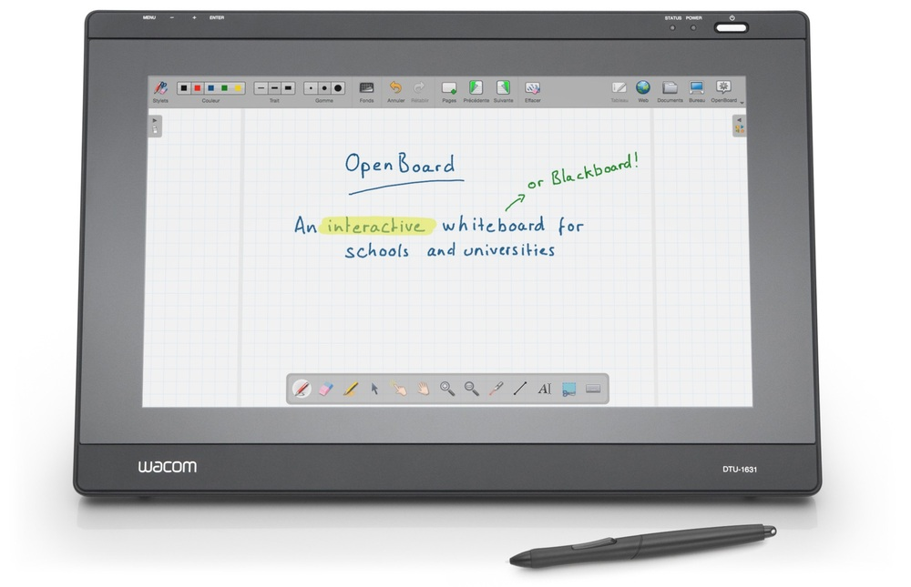

# Projets non retenus

## Platform manager

**Site du logiciel** : ?

**Son code source** : [gitlab.inria.fr/sisr/pfmanager](https://gitlab.inria.fr/sisr/pfmanager)

**Langages de programmation** : PHP

**Ministère utilisateur et porteur de la contribution** : MESRI/CNRS

**Description du logiciel et de son usage dans l'administration** : Au
sein du laboratoire Loria (UMR 7503 CNRS / Inria / Université de
Lorraine), nous utilisons plusieurs plateformes en soutien de la
recherche. Nous avons créé l’outil 'Platform manager' pour nous aider
à gérer ces installations: projets en cours, équipements, utilisateurs

**Idée de contribution** : L'objectif du stage sera d'apporter deux
fonctionnalités à ce logiciel pour 1) l'ajout d'un module de
réservation d'équipement avec calendrier, 2) la génération automatique
de pages wiki Gitlab par projet.

## GlitchTip

**Site du logiciel** : [glitchtip.com](https://glitchtip.com/)

**Son code source** : [gitlab.com/glitchtip](https://gitlab.com/glitchtip)

**Langages de programmation** : Python, Javascript.

**Ministère utilisateur et porteur de la contribution** : Ministère de la
Justice.

**Description du logiciel et de son usage dans l'administration** :
GlitchTip permet de collecter et de visualiser les erreurs émises par
une application.  Cette application n'est pas encore utilisée mais
elle est très demandée au ministère de la Justice car elle permettrait
un meilleur suivi des déploiements et des bugs.

**Idée de contribution** : Aujourd'hui, GlitchTip est déployable avec
Docker.  Le but du stage serait d'explorer d'autres façons de déployer
GlitchTip, par exemple avec NixOS.  Idéalement, nous pourrions aussi
voir comment brancher GlitchTip sur des systèmes d'authentification unique (SSO) classiques comme
[LemonLDAP](https://lemonldap-ng.org/welcome/), ainsi qu'ajouter des tutoriels en français.  Le ministère
porteur de la contribution a déjà un agent public qui contribue à
GlitchTip, facilitant ainsi le lien avec le projet et l'intégration
des contributions.

## Sentry

**Site du logiciel** : [sentry.io](https://sentry.io)

**Son code source** : [github.com/getsentry/sentry](https://github.com/getsentry/sentry)

**Langages de programmation** : Python, Javascript.

**Ministère utilisateur et porteur de la contribution** : Ministère de
l'Économie, des Finances et de la Relance, pôle d'expertise et de
régulation numérique - [PEReN](https://www.peren.gouv.fr/).

**Description du logiciel et de son usage dans l'administration** :
sentry.io permet de suivre les bugs directement en production.  SEntry
existe en version installable (voir [getsentry/onpremise](https://github.com/getsentry/onpremise)) et en
*Software as a Service* (SaaS), mais cette dernière version est
difficilement utilisable pour des raisons évidentes de confidentialité
de données (personnelles ou métiers). 

**Idée de contribution** : Le but de la contribution serait de faciliter
l'installation de SEntry dans différents environnements.  Aujourd'hui,
la seule méthode d'installation officiellement supportée est Docker,
Un *repackaging* "administration publique" de cet outil, incluant une
dé-dockerisation serait très utile pour les ministères régaliens.

## Openboard

**Site du logiciel** : [openboard.ch](https://openboard.ch/)

**Son code source** : [github.com/OpenBoard-org/OpenBoard](https://github.com/OpenBoard-org/OpenBoard)

**Langages de programmation** : C++/Qt

**Ministère utilisateur et porteur de la contribution** : Ministère de l'éducation nationale

**Description du logiciel et de son usage dans l'administration** :

Le logiciel openboard est plutôt orienté pour le primaire actuellement. 

**Idée de contribution** : 

Intégrer un object formule mathématique utilisant la syntaxe LaTex pour faciliter l'utilisation du logiciel dans le secondaire et le supérieur.

**A discuter** : le logiciel xournal++ que le demandeur mentionne semble bien répondre au problème. Openboard ne semble plus tellement maintenu (beaucoup de PR, dernier commit il y a 7 mois) contrairement à xournal++ qui donc dispose de la fonctionnalité et dont la communauté est plus active. 

## ElabFTW

**Site du logiciel** : [ElabFTW](https://www.elabftw.net)

**Son code source** : [github.com/elabftw/elabftw](https://github.com/elabftw/elabftw)

**Langages de programmation** : PHP/Javascript/HTML

**Ministère utilisateur et porteur de la contribution** : INRAE

**Description du logiciel et de son usage dans l'administration** :
L'outil est utilisé dans plusieurs établissements publics ainsi que
des laboratoires Européens en tnat que cahier de laboratoire
électronique.

**Idée de contribution** : L'objet du stage serait de travailler sur un
interfaçage avec un appareil mobile (liseuse, tablette,&#x2026;) avec une
possibilité de travailler sans connexion internet.

# Projets d'administrations centrales

## APiLos

**Site du logiciel** : <https://beta.gouv.fr/startups/apilos.html>

**Son code source** : Pas de code source.

**Langages de programmation** : ?

**Ministère utilisateur et porteur de la contribution** : Ministère du
développement durable.

**Description du logiciel et de son usage dans l'administration** : APiLos
est une plateforme de digitalisation du processus de conventionnement
des logements sociaux (contrat entre l'état et le bailleur définissant
le loyer au m² et les conditions de ressources pour l'attribution des
logements). L'objectif est d'améliorer l'expérience utilisateur des
bailleurs et instructeurs des conventions, de réduire l'insécurité
locative des nouveaux entrants dans des logements sociaux en attente
de conventionnement et de promouvoir la construction de logement
sociaux.

La plateforme est en beta. Elle est actuellement utilisée dans les
bouches du Rhône par les bailleurs de type HLM et les services
d'instruction des conventions APL.

**Idée de contribution** : Nous souhaitons ajouter la possibilité de
signer électroniquement les conventions entre les bailleurs et l'état
et créer un coffre-fort unique de stockage sécurisé pour toutes les
conventions signées et accessibles selon les permissions à l'ensemble
des administrations qui en ont besoin : CAF, MSA, préfecture, service
des hypothèques.

## OpenTermsArchive

**Site du logiciel** : [opentermsarchive.org](https://opentermsarchive.org)

**Son code source** : [github.com/ambanum/OpenTermsArchive](https://github.com/ambanum/OpenTermsArchive)

**Langages de programmation** : Javascript

**Ministère utilisateur et porteur de la contribution** : Ministère de
l'Europe et des affaires étrangères.

**Description du logiciel et de son usage dans l'administration** :
OpenTermsArchive est utilisé pour suivre les stratégies des grandes
plateformes numériques et pour identifier des leviers diplomatiques
dans les échanges avec elles. Au sein du PEReN (Ministère des
finances), OpenTermsArchive est utilisé pour suivre les évolutions des
conditions d'utilisation des fournisseurs de service par type
d'industrie (en particulier plateformes de mise en relation).  Au sein
de l'autorité de la concurrence, les agents en charges d'enquêtes
peuvent accéder aux conditions d'utilisation des fournisseurs de
services à toute date afin de mener des investigations détaillées.

**Idée de contribution** : 
L'objectif du stage sera de maintenir et de
compléter les descriptions de services qui sont suivis et archivés dans
OpenTermsArchive. En effet, au fur et à mesure des évolutions des documents,
ils peuvent être déplacés vers d'autres URLs, leur contenu peut être modifié et
il faut les filtrer d'une nouvelle manière pour éviter du bruit dans les
changements détectés. Toute liberté sera donnée pour expérimenter des moyens
d'outiller et d'automatiser ces mises à jour cruciales pour le bon
fonctionnement du service. Ces expérimentations seront co-construites et
évaluées par l'équipe coeur, qui pourra le cas échéant allouer des ressources
afin d'aider la personne en stage à industrialiser la solution et la mettre
entre les mains d'un grand nombre d’utilisateurs.

